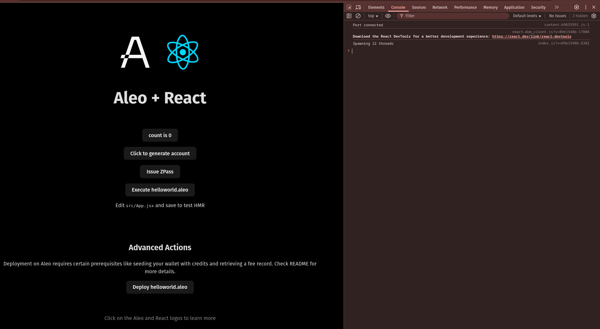
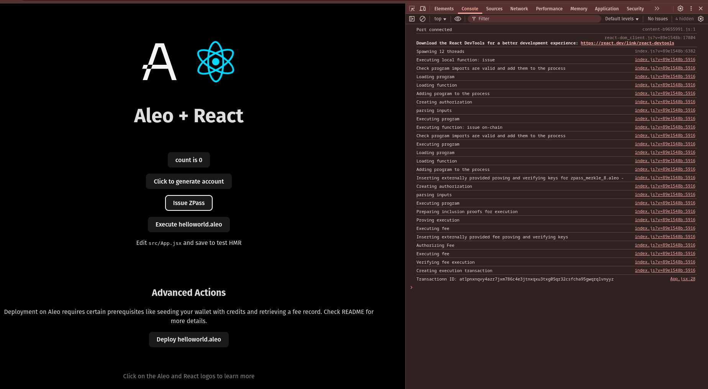

# ZPass Integration

## Create React Leo App:
- Command:
    ```sh
    npm create leo-app@latest
    ```
    
    <details><summary> Detailed Output </summary><blockquote>

    ~~~sh
    > npx
    > create-leo-app

    ✔ Project name: … shantibhdr_leo_zpass_integration
    ✔ Select a framework: › React
    ✔ Select a variant: › JavaScript + Leo

    Done. Now run:

    cd shantibhdr_leo_zpass_integration
    npm install
    npm run dev
    ~~~

    </blockquote></details>

- Install Dependencies:
    ```sh
    npm i zpass-sdk vite-plugin-wasm
    ```

## Start Project:
- Command:
    ```sh
    npm run dev
    ```
- Then, visit [http://localhost:5173](http://localhost:5173).

    

- Click in `Issue ZPass` Button:
    


- Here, in my case Transaction ID: `at1pnxnqvy4azr7jxm786c4e3jtnxqxu3txg05qr32csfcha95gwqrqlvnyyz`

# Signature:

## Sign with `Transaction ID`:
- For me, program deployed Transaction ID is: `at1pnxnqvy4azr7jxm786c4e3jtnxqxu3txg05qr32csfcha95gwqrqlvnyyz`. Command:
    ```sh
    leo account sign -d --private-key <redacted> --message "at1pnxnqvy4azr7jxm786c4e3jtnxqxu3txg05qr32csfcha95gwqrqlvnyyz" --raw
    ```
- Output:
    ```sh
    sign1jj0a9w78ex0rd0ggn5g9qp6k3ktcsw425elrxz8svwdxk2j9euqv8k2a8pvg7ywqc2vavq7rra9k8pa9c6hsrkuquj0ja3z50y2mcqq4ffacle92zstq39ee3p0rhs0e72s82347njy46syj48qndudpq6qcgetyt3lfr2zxcmm00r3p4azwpm09vch658vnf9g9v5g56rz3qsz4h9n
    ```