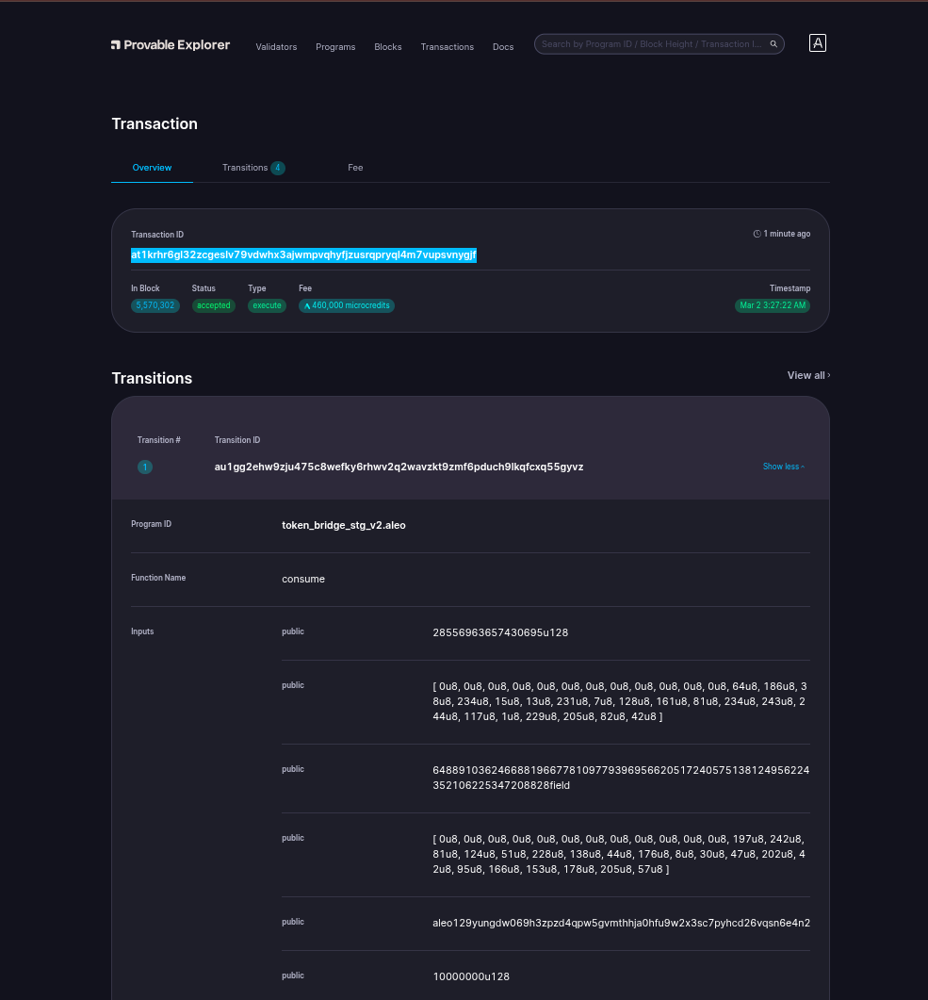

# Bridging On Aleo

- Transaction ID: `at1krhr6gl32zcgeslv79vdwhx3ajwmpvqhyfjzusrqpryql4m7vupsvnygjf`.
  
    

- Here, I transferred 10 USDC from ETH Sepolia Network to ALEO Testnet.

# Signature:

## Sign with `Transaction ID`:
- For me, program deployed Transaction ID is: `at1krhr6gl32zcgeslv79vdwhx3ajwmpvqhyfjzusrqpryql4m7vupsvnygjf`. Command:
    ```sh
    leo account sign -d --private-key <redacted> --message "at1krhr6gl32zcgeslv79vdwhx3ajwmpvqhyfjzusrqpryql4m7vupsvnygjf" --raw
    ```
- Output:
    ```sh
    sign122ushgt09xfj8qtm2tgtgsa6fz3039j54der4fk8vveg2dc87cqy87kpx3gsf7dwswztzs2hlxd0xpgarj6nytgz6se93c8my6cxyqs4ffacle92zstq39ee3p0rhs0e72s82347njy46syj48qndudpq6qcgetyt3lfr2zxcmm00r3p4azwpm09vch658vnf9g9v5g56rz3qd623ks
    ```